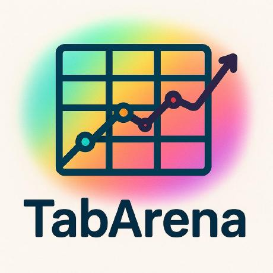

TabArena
========

.. raw:: html

   

   
   
   
   
   

Overview
--------

TabArena is a living benchmark suite for machine learning on tabular data, introduced at NeurIPS 2025 Datasets & Benchmarks Track. It curates ~51 tabular classification and regression tasks sourced from OpenML (study ``tabarena-v0.1``), each with pre-defined cross-validation splits (folds and repeats) for reproducible evaluation.

Tasks span binary classification, multiclass classification, and regression across diverse domains. All data and splits are downloaded from OpenML and cached locally as Arrow IPC files on first use.

- **Total tasks**: ~51 curated OpenML tasks
- **Problem types**: binary classification, multiclass classification, regression
- **Splits**: pre-defined OpenML fold/repeat cross-validation splits per task
- **Source**: `OpenML study tabarena-v0.1 <https://www.openml.org/>`_

Data Structure
--------------

``TabArena.load()`` returns a :class:`TabularDataset` instance. Each dataset wraps a PyArrow table containing all feature columns plus the target column, together with pre-defined cross-validation splits.

**TabularTaskInfo metadata**

.. list-table::
   :header-rows: 1
   :widths: 25 20 55

   * - Attribute
     - Type
     - Description
   * - ``task_id``
     - int
     - OpenML task ID
   * - ``task_name``
     - str
     - Dataset name (e.g. ``"credit-g"``)
   * - ``problem_type``
     - str
     - ``"binary"``, ``"multiclass"``, or ``"regression"``
   * - ``target_col``
     - str
     - Name of the target column
   * - ``n_rows``
     - int
     - Total number of rows in the full dataset
   * - ``n_features``
     - int
     - Number of feature columns (excluding the target)
   * - ``n_folds``
     - int
     - Number of CV folds
   * - ``n_repeats``
     - int
     - Number of CV repeats

**TabularDataset properties**

.. list-table::
   :header-rows: 1
   :widths: 25 20 55

   * - Property / Method
     - Returns
     - Description
   * - ``ds.table``
     - ``pa.Table``
     - Full Arrow table — all columns including the target
   * - ``ds.X``
     - ``pa.Table``
     - Feature columns only (target excluded)
   * - ``ds.y``
     - ``pa.ChunkedArray``
     - Target column
   * - ``ds.to_pandas()``
     - ``pd.DataFrame``
     - Full table as a pandas DataFrame
   * - ``ds[i]``
     - dict
     - Single row as a plain Python dict
   * - ``ds[i:j]``
     - ``TabularDataset``
     - Row slice as a new in-memory dataset
   * - ``ds.get_fold(fold, repeat)``
     - ``(train, test)``
     - Pre-defined train/test split for a given fold and repeat
   * - ``ds.iter_folds()``
     - iterator
     - Yields ``(fold, repeat, train, test)`` for every CV combination

Cache Layout
------------

Tasks are cached under ``~/.stable-datasets/processed/tabarena/`` (respects the ``STABLE_DATASETS_CACHE_DIR`` environment variable)::

    task_<task_id>/
    ├── data.arrow       Arrow IPC file — full table, all columns incl. target
    ├── splits.json      {repeat: {fold: [train_indices, test_indices]}}
    └── metadata.json    TabularTaskInfo fields

Usage Example
-------------

**List all task IDs**

.. code-block:: python

    from stable_datasets.tabular import TabArena

    # Fetches the task list from OpenML on first call, then caches in memory
    ids = TabArena.task_ids()
    print(f"TabArena contains {len(ids)} tasks")

**Load a single task by ID**

.. code-block:: python

    from stable_datasets.tabular import TabArena

    # Downloads and caches on first use; loads from cache on subsequent calls
    ds = TabArena.load(task_id=363621)

    print(ds)
    # TabularDataset(task='credit-g', n_rows=1000, problem_type='binary',
    #                n_folds=10, n_repeats=1)

    print(ds.task_name)      # "credit-g"
    print(ds.problem_type)   # "binary"
    print(ds.n_folds)        # 10

**Load by dataset name**

.. code-block:: python

    # Slower: scans the local cache first, then queries OpenML if not found.
    # Prefer task_id for repeated or performance-sensitive usage.
    ds = TabArena.load(task_name="credit-g")

**Access features and target**

.. code-block:: python

    from stable_datasets.tabular import TabArena

    ds = TabArena.load(task_id=363621)

    # PyArrow tables
    X = ds.X          # feature columns
    y = ds.y          # target column

    # Pandas DataFrame
    df = ds.to_pandas()
    print(df.shape)   # (1000, 21)  — features + target

    # Row-level access
    row = ds[0]       # plain Python dict
    print(row.keys())

**Cross-validation with pre-defined folds**

.. code-block:: python

    from stable_datasets.tabular import TabArena

    ds = TabArena.load(task_id=363621)

    # Single fold
    train, test = ds.get_fold(fold=0, repeat=0)
    print(len(train), len(test))

    # Iterate all folds
    for fold, repeat, train, test in ds.iter_folds():
        X_train = train.X.to_pandas()
        y_train = train.y.to_pylist()
        X_test  = test.X.to_pandas()
        y_test  = test.y.to_pylist()
        # ... fit and evaluate your model

**Iterate the whole benchmark suite**

.. code-block:: python

    from stable_datasets.tabular import TabArena

    results = {}
    for ds in TabArena.iter_tasks():
        train, test = ds.get_fold(fold=0, repeat=0)
        # ... fit model, record metric
        results[ds.task_name] = {"problem_type": ds.problem_type}

    print(f"Evaluated {len(results)} tasks")

**Subset of tasks**

.. code-block:: python

    from stable_datasets.tabular import TabArena

    # Run only a specific subset of task IDs
    subset_ids = [363621, 359979, 359954]
    for ds in TabArena.iter_tasks(task_ids=subset_ids):
        print(ds.task_name, ds.n_rows, ds.problem_type)

References
----------

- Paper (OpenReview): https://openreview.net/forum?id=jZqCqpCLdU
- Code: https://github.com/autogluon/tabarena/
- OpenML study: https://www.openml.org/

Citation
--------

.. code-block:: bibtex

    @inproceedings{erickson2025tabarena,
      title={TabArena: A Living Benchmark for Machine Learning on Tabular Data},
      author={Nick Erickson and Lennart Purucker and Andrej Tschalzev and David Holzm{\"u}ller and Prateek Mutalik Desai and David Salinas and Frank Hutter},
      booktitle={The Thirty-ninth Annual Conference on Neural Information Processing Systems Datasets and Benchmarks Track},
      year={2025},
      url={https://openreview.net/forum?id=jZqCqpCLdU}
    }
